# Frugal QA Lab — Complete Technical Architecture & System Mechanics
> **The Exhaustive Engineering Guide to Frugal QA Lab**  
> Author: Jatin Senpai (`jatin-senpai`)  
> Focus: AI-Native Software Engineering, QA Automation & Security  
> Repository: [https://github.com/jatin-senpai/frugal-qa-lab](https://github.com/jatin-senpai/frugal-qa-lab)

---

## 1. Executive Summary & Monorepo Blueprint

**Frugal QA Lab** is a standalone, locally reproducible engineering and quality assurance testbed built to solve the complex automation and security challenges specified in the placement assessment.

Conventional automated testing frameworks (like Selenium or Cypress) typically rely on standard HTML DOM locators (IDs, class names, XPaths) and assume synchronous or polling-friendly UI updates. In high-performance, security-critical distributed systems, those assumptions break down:
- **Canvas 2D / WebGL runtimes** do not expose DOM nodes for buttons or visual elements.
- **WebSocket data streams** experience jitter, latency spikes, and ultra-tight race condition windows ($30\text{--}100\text{ ms}$).
- **Financial APIs** require microsecond-accurate cryptographic nonces and HMAC signatures to prevent sub-$150\text{ ms}$ packet replay attacks.
- **Web Components** encapsulate DOM subtrees using dynamic class obfuscation and W3C closed Shadow DOM security boundaries.

**Frugal QA Lab** provides real, executable testbeds that recreate these exact scenarios and proves their resilience using deterministic Playwright test suites.

```mermaid
flowchart TD
    subgraph Test_Runner["Playwright Test Engine (Single-Worker Isolation)"]
        TC1["Q1 Spec: Canvas Chaos & Race Interceptions\n(4 Automated Tests)"]
        TC2["Q2 Spec: Crypto Replay & Nonce Chaining\n(4 Automated Tests)"]
        TC3["Q3 Spec: Sealed Shadow DOM & AXTree\n(3 Automated Tests)"]
    end

    subgraph Q1["Q1 Subsystem: Canvas & WebSocket Testbed (:3001)"]
        Q1_Canvas["HTML5 Canvas 2D Terminal\n(requestAnimationFrame Render Loop)"]
        Q1_WS["WebSocket Server + Chaos Broker\n(Fibonacci Delay Progression: 1s -> 8s)"]
        Q1_Det["Zero-DOM Pixel State Detector\n(Loading Gray #788896 -> Active Green #00E676)"]
        Q1_Chain["Precision Action Chainer\n(Hover -> Drag 15px X -> Click in 30-100ms)"]
        Q1_CB["Coordinate Drift Circuit-Breaker\n(Pre/In-Flight Pixel Revalidation Macro)"]
        Q1_Err["Frontend Structured Exception Boundary\n(Catches '1e+7' / NaN Corrupted States)"]
    end

    subgraph Q2["Q2 Subsystem: Stateful Cryptographic Gateway (:3002)"]
        Q2_API["Express Mock Settlement API\n(POST /transactions -> PUT /transactions/:id)"]
        Q2_Signer["Canonicalizer & HMAC-SHA512 Signer\n(id | body | clientUs | serverTs | salt)"]
        Q2_Burst["Sub-150ms Replay Attack Engine\n(High-Resolution Exact Packet Burst)"]
        Q2_Cache["Sliding-Window Nonce Cache\n(Duplicate Signature -> HTTP 409 Conflict)"]
        Q2_Alert["Security Vulnerability Detection Engine\n(Traps Unprotected Routes -> CRITICAL_HIGH_RISK)"]
    end

    subgraph Q3["Q3 Subsystem: Sealed Shadow DOM Host (:3003)"]
        Q3_App["Multi-Level Custom Web Components\n(<enterprise-portal>, <payment-terminal>)"]
        Q3_Obf["Dynamic Class Obfuscator\n(Regenerates .obfuscated_v4_* on every load)"]
        Q3_Walker["Resilient Open Shadow Root Piercer\n(Recursive Tree Traversal)"]
        Q3_Proof["W3C Closed Boundary Proof\n(element.shadowRoot === null in runtime JS)"]
        Q3_AX["OS Accessibility Tree Pathfinding\n(Decoupled page.getByRole Semantic Locator)"]
    end

    TC1 -->|CDP & Mouse Macros| Q1_Canvas
    TC1 -->|WS Interception| Q1_WS
    Q1_Canvas <-->|Live Stream| Q1_WS
    TC1 --> Q1_Det
    TC1 --> Q1_Chain
    TC1 --> Q1_CB
    TC1 --> Q1_Err

    TC2 -->|POST / PUT HTTP| Q2_API
    TC2 --> Q2_Signer
    TC2 --> Q2_Burst
    Q2_API <--> Q2_Cache
    TC2 --> Q2_Alert

    TC3 -->|HTTP Host| Q3_App
    Q3_App --> Q3_Obf
    TC3 --> Q3_Walker
    TC3 --> Q3_Proof
    TC3 --> Q3_AX
```



---

## 2. Q1 — Canvas Chaos & WebSocket Race Engine

### 2.1 The HTML5 Canvas 2D Testbed (`q1-canvas-chaos/app/app.js`)

Unlike standard web applications where buttons exist as `<button>` DOM nodes, the Q1 trading terminal draws everything onto a single `<canvas id="trading-canvas" width="800" height="320">` element:
1. **The Render Loop**: Driven by `window.requestAnimationFrame()`. In every frame, the background is cleared, active candlestick chart lines are rendered across $y \in [40, 160]$, and an interactive confirmation button is drawn in the lower interactive zone ($y \in [220, 268]$, $x \in [480, 700]$).
2. **State Lifecycle**:
   - `DISCONNECTED`: Initial idle state before WebSocket handshake.
   - `LOADING`: WebSocket connection established; button renders in **Loading Gray** (`#788896`, RGB: `[120, 136, 150]`) while waiting for orderbook book synchronization.
   - `ACTIVE`: Synchronization complete; button turns **Active Green** (`#00E676`, RGB: `[0, 230, 118]`). Clicking is only valid in this state.
   - `EXECUTED`: Chained action completed; button turns **Blue** (`#2979FF`).
   - `ERROR`: Mathematical corruption detected; trading engine immediately halts rendering and transfers control to the HTML error boundary.

### 2.2 WebSocket Broker & Fibonacci Jitter (`q1-canvas-chaos/server/app.js` & `networkJitter.js`)

The orderbook ticks stream over a local WebSocket server (`ws://localhost:3001/ws`).
- **The Fibonacci Jitter Model**: Network latency is non-linear. The broker calculates frame delivery delay as:
  $$D_n = \min(1000 \times \text{Fib}(n), 8000)\text{ ms}$$
  Progression sequence: $1000\text{ms}, 1000\text{ms}, 2000\text{ms}, 3000\text{ms}, 5000\text{ms}, 8000\text{ms}$ (capped).
- **Chaos Injection**: Intercepted in Playwright via CDP session or browser-side WebSocket wrapping, injecting exact latency intervals to simulate severe network degradation during state synchronization.

### 2.3 Zero-DOM Pixel Detection (`q1-canvas-chaos/src/pixelDetector.js`)

Because standard Playwright locators (`page.locator('button')`) cannot find elements drawn on a canvas, we implement an embedded in-page pixel detector that observes the canvas directly:
- **`requestAnimationFrame` Polling**: The observer runs inside the browser context using `page.evaluate()`, checking frames synchronously with the browser's display refresh rate.
- **Dual-State Detection**:
  1. *Phase 1 (Confirm Loading)*: Scans the interactive zone ($y \ge 180$) to verify that pixels match the loading gray threshold ($|R-120| \le 25, |G-136| \le 25, |B-150| \le 25$).
  2. *Phase 2 (Detect Transition)*: Scans for active green pixels ($G > 180, R < 80, B < 160$).
- **Contour Bounding**: Identifies contiguous pixel bounding boxes ($(X_{\max} - X_{\min}) \ge 60\text{px}$, $(Y_{\max} - Y_{\min}) \ge 20\text{px}$) to avoid false positives from the green chart candlesticks rendered in the upper canvas area.
- **Offset Sampling**: Samples pixels at `minX + 10, minY + 10` rather than the exact geometric center to prevent sampling the black text glyphs ("CONFIRM ORDER") drawn at the center of the button.

### 2.4 Precision Action Chainer (`q1-canvas-chaos/src/actionChainer.js`)

The assessment requires executing a compound mouse sequence within a strict **30–100ms race window** following state activation:
1. **Action Sequence**: `Hover` $\to$ `Mouse Down` $\to$ `Drag 15px along X-axis` $\to$ `Mouse Up / Click`.
2. **Unified Clock Domains**: To avoid clock skew between the Node.js test process and browser DOM contexts, the detection timestamp is recorded in the Node process immediately when the pixel detection promise resolves. The action sequence executes, measuring:
   - `totalElapsedSinceDetectionMs`: $85.64\text{ms}$ (strictly within $30\text{--}100\text{ms}$).
   - `actionExecutionDurationMs`: $81.78\text{ms}$ ($\le 100\text{ms}$).

### 2.5 Coordinate Drift Circuit-Breaker (`q1-canvas-chaos/src/circuitBreaker.js`)

In dynamic UIs, layout shifts or repaint lag can displace visual elements between detection and execution:
1. **Pre-Flight Check**: The circuit breaker samples the pixel at the cached target coordinate (`samplePixelState`).
2. **Tripping the Breaker**: If the pixel is not active green (e.g., target shifted or frame is stale), the circuit breaker trips (`this.state = 'TRIPPED'`).
3. **Recovery Scan**: It triggers `recalculateActiveCoordinates`, re-scanning the canvas to locate the button's new position.
4. **Execution & State Transition**: Upon locating the target, it updates coordinates, sets `this.state = 'RECOVERED'`, and dispatches the action.
- *Verified in Test 3*: By passing a forced stale coordinate offset ($-150\text{px}$), the test proves that `trippedCount: 1` and `circuitBreakerState: 'RECOVERED'` occur deterministically, executing the trade without blind misclicks.

### 2.6 Mathematical State Corruption & Exception Boundary (`q1-canvas-chaos/app/app.js`)

To prevent silent financial corruption, the frontend enforces strict runtime type and boundary validation on incoming payloads:
- **Corrupted Payloads**: The server injects scientific notation (e.g. `balance: "1e+7"`), non-finite numbers (`NaN`, `Infinity`), or fractional balances with $>2$ decimal places.
- **Validation**: Regex `/[eE]/.test(rawVal)` and decimal checks catch the violation.
- **Exception Boundary**: The trading engine immediately halts rendering, sets status to `ERROR`, and activates the DOM structured error boundary `<div id="canvas-error-boundary">` displaying error code `ERR_STATE_CORRUPTION_MATHEMATICAL_BOUNDARY`.

---

## 3. Q2 — Stateful Cryptographic API & Replay Defense

### 3.1 Stateful Settlement Mock Gateway (`q2-crypto-replay/server/app.js`)

Q2 implements a stateful financial transaction settlement API running on `http://localhost:3002`:
- `POST /transactions`:
  1. Generates a unique transaction identifier: `txn_<24-hex-chars>`.
  2. Generates a random cryptographic challenge token: `ch_<32-hex-chars>`.
  3. Records server timestamp: `serverTimeMs`.
  4. Returns `X-Transaction-Id` in the response header and `challengeToken` + `serverTimeMs` in the JSON body.

### 3.2 Canonicalization & HMAC-SHA512 Signing (`q2-crypto-replay/src/cryptoSigner.js`)

To prevent signature mismatches caused by varying JSON key serialization orders across platforms, the client and server implement deterministic canonicalization:
1. **`canonicalizeJson(obj)`**: Recursively sorts all object keys in lexicographical (ASCII) order before serialization.
2. **Microsecond Timestamping (`getMicrosecondTimestamp`)**: Combines `Date.now() * 1000` with sub-millisecond precision from `performance.now() % 1`.
3. **The 5-Tuple String-to-Sign**:
   $$\text{StringToSign} = \text{transactionId} \mid \text{canonicalBody} \mid \text{clientTimestampUs} \mid \text{serverTimestamp} \mid \text{challengeToken}$$
4. **Signature Generation**: Computes `crypto.createHmac('sha512', secret).update(StringToSign).digest('hex')` and attaches it via the `X-Frugal-Mac` request header.
5. **Constant-Time Verification**: Server verifies the signature using `crypto.timingSafeEqual()` to defend against timing side-channel attacks.

### 3.3 Sub-150ms Replay Attack Engine (`q2-crypto-replay/src/replayClient.js`)

To simulate an attacker intercepting and replaying financial packets:
- `executeReplayAttack()` dispatches an initial valid `PUT /transactions/:id` request.
- Immediately upon completion, it dispatches an **exact duplicate packet** (identical timestamp, identical challenge token, identical payload, and identical `X-Frugal-Mac`).
- **Burst Delta**: The duplicate packet is transmitted and received in **0.74ms** (well within the required $<150\text{ms}$ threshold).

### 3.4 Replay Defense & HTTP 409 Conflict

The server maintains a sliding-window signature cache (`seenSignatures: Map<mac, metadata>`) with a 5000ms TTL:
- When the duplicate packet arrives, the server checks `seenSignatures.has(clientMac)`.
- Because the signature already exists in the cache, the server rejects the duplicate with **`HTTP 409 Conflict`** and error code `ERR_TRANSACTION_REPLAY_DETECTED`.

### 3.5 Negative Mutation Security Matrix

The test suite validates four distinct tampering attack vectors:
1. **Tampered Body**: Modifying `{ amount: 1000 }` to `{ amount: 999999 }` while keeping the original MAC returns **`HTTP 401 Unauthorized`**.
2. **Tampered Timestamp**: Altering `X-Client-Timestamp-Us` by $+10\mu\text{s}$ without recomputing the MAC returns **`HTTP 401 Unauthorized`**.
3. **Corrupted MAC**: Modifying the final hex characters of the signature returns **`HTTP 401 Unauthorized`**.
4. **Stale Timestamp**: Sending a packet whose timestamp is $>10\text{ seconds}$ old returns **`HTTP 422 Unprocessable Entity`** before signature verification occurs.

### 3.6 Security Vulnerability Detection Engine (`q2-crypto-replay/src/telemetry.js`)

To ensure that automated test suites catch accidental regressions where replay defense is mistakenly disabled:
- The server provides an intentionally vulnerable test route (`/transactions/vulnerable-replay/:id`) that processes updates without duplicate signature checks.
- When `executeReplayAttack` receives an `HTTP 200 OK` for a duplicate packet, the security layer traps the condition and raises an explicit alert:
  ```text
  🚨 [HIGH_RISK_SECURITY_ALERT] HIGH-RISK DATA-MUTATION VULNERABILITY DETECTED: 
  Server permitted duplicate transaction replay!
  ```

---

## 4. Q3 — Sealed Closed-Boundary Shadow DOM & Accessibility

### 4.1 Nested Web Component Hierarchy (`q3-shadow-dom/app/components.js`)

Q3 hosts a multi-level custom element hierarchy running on `http://localhost:3003`:
```html
<enterprise-portal class="obfuscated_v4_x89a">
  #shadow-root (open)
  <payment-terminal class="obfuscated_v4_b12c">
    #shadow-root (open)
    <security-sandbox>
      #shadow-root (closed)
      <button class="obfuscated_v4_z99q" aria-label="Authorize Ledger Funds">
        Authorize Ledger Funds
      </button>
    </security-sandbox>
  </payment-terminal>
</enterprise-portal>
```
- **Dynamic Class Obfuscation**: Every page refresh executes `Math.random().toString(36)` to generate randomized CSS class names (e.g. `.obfuscated_v4_ifewy`).
- **Zero Static Selectors**: Tests cannot use static CSS classes, static IDs, or absolute XPaths.

### 4.2 Resilient Open Shadow Root Piercing (`q3-shadow-dom/src/resilientWalker.js`)

For open shadow roots, the framework implements a recursive tree walker that descends through `element.shadowRoot`, inspecting child elements based on semantic attributes (`role`, `aria-label`, button type) rather than classes or tags.

### 4.3 W3C Closed Boundary Security Proof (`q3-shadow-dom/src/closedBoundaryProof.js`)

Per the W3C DOM Level 4 and Shadow DOM v1 specifications:
- When a custom element invokes `this.attachShadow({ mode: 'closed' })`, the browser C++ DOM bindings (V8/Blink, WebKit) permanently restrict access to the shadow root outside the constructor closure.
- In standard page runtime JavaScript, `element.shadowRoot` strictly returns **`null`**.
- *Engineering Principle*: The framework explicitly tests and proves this boundary (`expect(closedHost.shadowRoot).toBeNull()`). It documents why theoretical claims of "piercing closed Shadow DOM using standard runtime DOM selectors" are technically invalid.

### 4.4 Decoupled OS Accessibility Tree Pathfinding (`q3-shadow-dom/src/accessibilityHelper.js`)

Because closed Shadow DOM encapsulation isolates the DOM tree but **does not isolate the operating system accessibility tree**, modern quality engineering relies on accessibility semantics:
- Playwright's `page.getByRole('button', { name: 'Authorize Ledger Funds' })` interacts directly with the browser's computed Accessibility Tree (Chromium AXTree).
- The test demonstrates locating and clicking the authorization button inside the closed boundary, successfully mutating ledger state without DOM piercing.

### 4.5 Production AI Navigation System Prompt (`q3-shadow-dom/src/systemPromptCoT.md`)

The prompt artifact instructs autonomous agents to navigate accessibility trees without relying on fragile DOM attributes:
- **Objective**: Target UI controls across encapsulated Web Components purely via the computed Accessibility Tree Hierarchy.
- **Strict Constraints**: Forbids DOM IDs, CSS class selectors, absolute XPaths, raw innerText scraping, and HTML tag assumptions.
- **Available Representation**: Accessible roles (`AXRole`), states (`AXBusy`, `AXDisabled`), properties (`AXName`, `AXDescription`), and live regions (`AXLiveRegion`).
- **Decision Criteria**: Intent-to-role mapping, ancestor disambiguation, and state verification.
- **Zero Private CoT Exposure**: Requires clean, structured JSON output (`status`, `target`, `playwrightLocator`) without leaking internal reasoning steps.

---

## 5. Section 0 & Section B Deliverables

### 5.1 Pre-Evaluation Alignment (`section-0/alignment.md`)
Contains formally articulated answers to all mandatory disclosure prompts:
- Question 1: Explicit consent to the 36-month service agreement.
- Question 2: Acknowledgment and acceptance of the CTC structure (₹22,000/mo internship $\to$ ₹7 LPA – ₹10 LPA full-time).
- Question 3: Affirmative commitment to relocate to Hyderabad.
- Question 4: Motivation for choosing Frugal Testing / BuildNexTech.
- Question 5: Articulation of company value proposition.
- Question 6: Defensible professional justification for prioritizing this opportunity.

### 5.2 17 Analytical Engineering Scenarios (`section-b/answers.md`)
Questions Q4 through Q20 address real-world systems, performance, security, and quality engineering scenarios. Each answer is structured under an internal 6-point reasoning model (`Failure Mechanism`, `Root Cause`, `Why Naive Testing Misses It`, `Deterministic Solution`, `Telemetry/Assertion/Control`, `Trade-off`) and strictly bounded to **$\le 150$ words each**:
- **Q4 (Async Event Loop Blocking)**: CPU-bound JSON parsing starving I/O polling; resolved by worker threads or chunked streams.
- **Q5 (Heap Out-Of-Memory)**: Unbounded WebSocket connection state caching; resolved by weak references and memory threshold governors.
- **Q6 (AST-Driven Test Selection)**: Avoiding whole-suite execution on PRs; resolved by Babel/TypeScript AST dependency graph diffing.
- **Q7 (Database Deadlocks)**: Divergent index acquisition ordering; resolved by deterministic sorting of record IDs before batch updates.
- **Q8 (HikariCP Starvation)**: Leaked unclosed connections; resolved by `leakDetectionThreshold` and automated connection reaping.
- **Q9 (MCP Sandbox Isolation)**: Arbitrary code execution by autonomous agents; resolved by Linux namespaces and seccomp syscall filters.
- **Q10 (Distributed Tracing Gaps)**: Context loss across asynchronous queues; resolved by OpenTelemetry W3C tracecontext header injection.
- **Q11 (Kafka Head-of-Line Blocking)**: Poison pill messages stalling consumer partitions; resolved by non-blocking dead-letter retry queues.
- **Q12 (Cache Stampede / Thundering Herd)**: Simultaneous cache miss on expired keys; resolved by Mutex locking and probabilistic early recomputation (XFetch).
- **Q13 (Dynamic Token Expiry Race)**: JWT expiration mid-flight; resolved by proactive refresh token buffer windows.
- **Q14 (Flaky Visual Regressions)**: Font rendering anti-aliasing differences across OSes; resolved by containerized Linux Chromium runners.
- **Q15 (Eventual Consistency Glitches)**: Reading from replica before replication lag settles; resolved by read-after-write primary pinning.
- **Q16 (Zero-Downtime Migration)**: Schema alterations locking tables; resolved by expand-and-contract multi-phase dual-writing.
- **Q17 (HIPAA Data Pipeline Architecture)**: Resource allocation matrix (Unit 30%, AppSec 25%, API 20%, Load 15%, Visual 10%) with synthetic PHI masking.
- **Q18 (OpenAPI Boundary Exploitation)**: Security fuzzing against boundary values (`1e+7`, negative amounts, recursive JSON depth $>5$).
- **Q19 (Automated Release Sign-Off Gates)**: Formal gate rules engine ingesting coverage, Trivy CVEs, and Jira blockers with automated rollback triggers.
- **Q20 (Closed-Loop Production Stress Testing)**: Dynamic KEDA stress runners scaling from production OpenTelemetry and APM traffic patterns.

### 5.3 Behavioral Alignment Decisions (Situations A–D)
- **Situation A (Undocumented Legacy Crash)**: **Choice ii** (Defensive error handling wrapper with telemetry; avoids risky pre-release structural rewrite).
- **Situation B (Autonomous AI Alignment Conflicts)**: **Choice i** (Pause deployment loop, audit prompt architecture, embed linting rules; prevents architectural drift).
- **Situation C (Technical Ambiguity vs. Speed)**: **Choice ii** (Rapid end-to-end prototyping to gather live feedback loops before finalizing abstractions).
- **Situation D (Code-Coverage Metric Divergence)**: **Choice i** (Challenge the vanity 95% statement coverage mandate; lead transition to mutation and contract testing).

### 5.4 Q21 Technical Article (`section-b/article.md`)
- **Title**: *Securing the AI Workspace: Designing Restrictive Model Context Protocol (MCP) Sandboxes to Prevent Arbitrary Code Executions by Autonomous Developer Agents*
- **Word Count**: **1,390 words** (verified by `wc -w`; strictly within the 750–1500 words limit).
- **Technical Coverage**: Threat modeling (Indirect Prompt Injection, hallucinatory loops), zero-trust MCP architecture, typed JSON schemas (`additionalProperties: false`), Linux kernel isolation (`CLONE_NEWNS`, `CLONE_NEWNET`, `seccomp-bpf`, Landlock LSM, OverlayFS), direct binary execution via `execFile` (bypassing `/bin/sh`), architectural trade-offs, and stateful behavioral governors.

### 5.5 Q22 Portfolio Compilation & Q23 Video CV Script
- **Q22 Portfolio ([`section-b/portfolio.md`](file:///Users/yashshviyadav/Projects/frugal_testing/frugal-qa-lab/section-b/portfolio.md))**: Structured template with GitHub project links and social media engagement checklists. Placeholders explicitly labeled `[REQUIRES CANDIDATE INPUT]`.
- **Q23 Video CV Script ([`section-b/video_cv_script.md`](file:///Users/yashshviyadav/Projects/frugal_testing/frugal-qa-lab/section-b/video_cv_script.md))**: 4-part script timed for 2m 30s (~432 words). Covers AI-Native engineering philosophy, Frugal QA Lab canvas/race condition challenge, responsible GenAI sandboxing, and first-principles debugging without GenAI.

---

## 6. How to Run, Test, and Verify Everything

### 6.1 Prerequisites & Installation
```bash
# Verify runtime versions
node --version    # Requires Node.js v20.x or v24.x LTS (tested on v24.11.0)
npm --version     # Requires npm v10.x or v11.x (tested on 11.6.1)

# Navigate to project root
cd /Users/yashshviyadav/Projects/frugal_testing/frugal-qa-lab

# Install dependencies
npm install

# Install Playwright browser binary
npx playwright install chromium
```

### 6.2 Running Automated Tests

#### Run the Entire Test Suite (11 Tests)
```bash
npm test
```
*Expected Output*: `11 passed (12.9s)` with exit code 0.

#### Run Q1 (Canvas Chaos & Race Interceptions)
```bash
npm run test:q1
# Or in headed mode to observe canvas rendering:
npx playwright test q1-canvas-chaos/tests/canvas-chaos.spec.js --headed
```

#### Run Q2 (Cryptographic Replay & Nonce Chaining)
```bash
npm run test:q2
```

#### Run Q3 (Sealed Shadow DOM & Accessibility)
```bash
npm run test:q3
```

### 6.3 Manual Server Inspection (Optional)
To run and inspect the testbed servers manually in your browser:
```bash
# Start Q1 Canvas App on http://localhost:3001
npm run start:q1
# Visit http://localhost:3001 (normal mode) or http://localhost:3001/?mode=corrupt

# Start Q2 Mock Settlement API on http://localhost:3002
npm run start:q2
# Visit http://localhost:3002/health

# Start Q3 Shadow DOM Application on http://localhost:3003
npm run start:q3
# Visit http://localhost:3003
```

### 6.4 Verifying Word Counts Deterministically
```bash
# Verify Q4-Q20 scenario answers (all <= 150 words)
python3 -c '
with open("section-b/answers.md") as f: text = f.read()
import re
for q, body, _ in re.findall(r"### (Q\d+)\..*?\n(.*?)(\n---|\Z)", text, re.DOTALL):
    words = len(body.strip().split())
    print(f"{q}: {words} words [OK]" if words <= 150 else f"{q}: {words} words [EXCEEDED]")
'

# Verify Q21 technical article word count (750 - 1500 words)
wc -w section-b/article.md
```

---

## 7. Directory & File Reference Map

```
frugal-qa-lab/
├── HOW_IT_WORKS.md                     # This complete technical reference guide
├── README.md                           # Master engineering README
├── FINAL_REQUIREMENTS_MATRIX.md        # Requirement-by-requirement audit matrix
├── package.json                        # Scripts and dependencies
├── playwright.config.js                # Playwright configuration (single worker, reporters)
├── .gitignore                          # Clean repository ignore patterns
│
├── q1-canvas-chaos/                    # [15 Points] HTML5 Canvas Chaos Subsystem
│   ├── app/
│   │   ├── index.html                  # Canvas container and error boundary markup
│   │   └── app.js                      # 2D canvas render loop, candlesticks, state machine
│   ├── server/
│   │   └── app.js                      # Express + ws WebSocket broker with Fibonacci delays
│   ├── src/
│   │   ├── actionChainer.js            # Precision 30-100ms mouse event execution engine
│   │   ├── circuitBreaker.js           # Coordinate drift circuit-breaker and revalidator
│   │   ├── networkJitter.js            # Fibonacci delay model (1s, 1s, 2s, 3s, 5s, 8s)
│   │   ├── pixelDetector.js            # requestAnimationFrame zero-DOM pixel scanner
│   │   └── telemetry.js                # Structured test metrics logger
│   ├── tests/
│   │   └── canvas-chaos.spec.js        # 4 Playwright automated test specifications
│   ├── artifacts/                      # Machine-readable test execution logs & results
│   └── README.md                       # Q1 architecture, sequence flows, and video plan
│
├── q2-crypto-replay/                   # [4 Points] Stateful Cryptographic Gateway Subsystem
│   ├── server/
│   │   └── app.js                      # Express settlement gateway with sliding-window cache
│   ├── src/
│   │   ├── cryptoSigner.js             # Canonical JSON stringifier & HMAC-SHA512 signer
│   │   ├── microTimer.js               # Microsecond-accurate timestamp provider
│   │   ├── replayClient.js             # Transaction creator and sub-150ms burst dispatcher
│   │   ├── telemetry.js                # Security audit and vulnerability alert logger
│   │   └── vulnerabilityAlert.js       # Dedicated security alert formatter
│   ├── tests/
│   │   └── crypto-replay.spec.js       # 4 Playwright automated test specifications
│   ├── artifacts/                      # Cryptographic audit logs, nonces, and results
│   └── README.md                       # Q2 threat model, canonical rules, and video plan
│
├── q3-shadow-dom/                      # [1 Point] Sealed Shadow DOM & Accessibility Subsystem
│   ├── app/
│   │   ├── index.html                  # Host page layout
│   │   └── components.js               # Nested custom Web Components (open and closed roots)
│   ├── server/
│   │   └── app.js                      # Static host server
│   ├── src/
│   │   ├── accessibilityHelper.js      # Computed Accessibility Tree snapshot extractor
│   │   ├── closedBoundaryProof.js      # W3C specification proof that closed shadowRoot === null
│   │   ├── resilientWalker.js          # Recursive open shadow DOM walker
│   │   └── systemPromptCoT.md          # 6-section AI accessibility navigation system prompt
│   ├── tests/
│   │   └── shadow-dom.spec.js          # 3 Playwright automated test specifications
│   ├── artifacts/                      # Accessibility tree snapshots & results
│   └── README.md                       # Q3 boundary analysis and video plan
│
├── section-0/
│   └── alignment.md                    # Pre-Evaluation Disclosures & Alignment (Bond, CTC, Relocation)
│
├── section-b/
│   ├── answers.md                      # Q4–Q20 Scenarios & Situations A–D (<=150 words each)
│   ├── article.md                      # Q21 Article on Restrictive MCP Sandboxes (1,390 words)
│   ├── portfolio.md                    # Q22 Portfolio links and social engagement checklist
│   └── video_cv_script.md              # Q23 2-to-3 minute Video CV presentation script
│
└── evidence/                           # Consolidated unsimulated execution evidence
    ├── q1/                             # Results.json, execution.log, and 4 canvas screenshots
    ├── q2/                             # Results.json, execution.log, and replay rejection traces
    └── q3/                             # Results.json, execution.log, and accessibility snapshots
```
